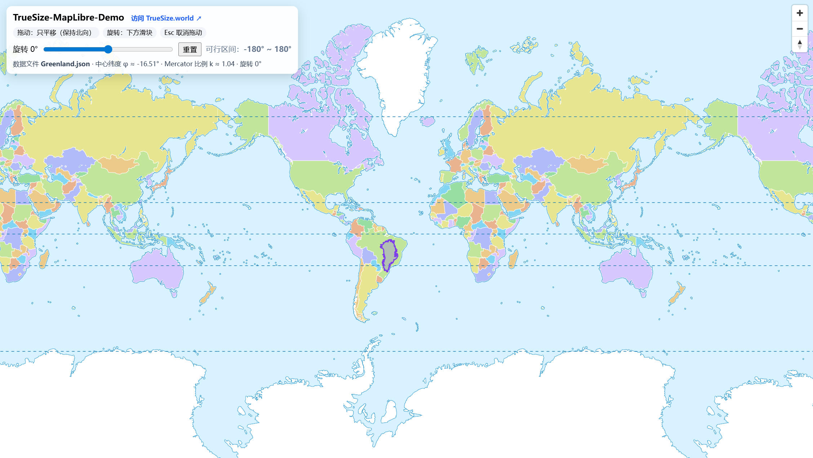

# TrueSize · MapLibre

一个基于MapLibre GL JS的交互式地图探索墨卡托地图投影下真实的国家地区形状大小。

## 功能特性

- 加载本地 GeoJSON 文件（Polygon / MultiPolygon）
- 支持鼠标拖动 **平移**（始终保持北向）
- 通过滑块进行 **旋转**，可重置角度
- 限制交互范围，避免越界（极区与投影边界）
- 实时显示：
  - 当前加载的数据文件名
  - 中心纬度
  - Mercator 投影缩放比例因子
  - 当前旋转角度
## 页面预览



## 技术实现思路

1. **地图渲染**
   - 使用 MapLibre GL JS 作为底图渲染引擎，加载官方示例样式。
   - 叠加一个 GeoJSON Source 和两个图层（填充 + 边界线）。

2. **GeoJSON 读取与预处理**
   - 从 URL 参数 `?file=xxx.json` 读取目标 GeoJSON 文件。
   - 自动识别 `Feature` / `FeatureCollection` / `Polygon` / `MultiPolygon` 类型。
   - 对坐标进行解包（unwrap）、重新对齐（recenter）、以及 Mercator 极限裁剪，保证显示正确。

3. **数学与投影**
   - 坐标在球面上转为三维向量，利用四元数实现旋转。
   - 通过球面插值（slerp）增加点密度，保证旋转后的几何边界平滑。
   - 计算中心点与北向切向量，确保旋转时保持参考方向。

4. **交互逻辑**
   - 鼠标拖拽：修改目标中心点坐标（纬度限制 ±80°）。
   - 滑块旋转：通过四元数与边界检测算法，保证旋转后图形仍在 Mercator 可视范围内。
   - “重置”按钮快速恢复到 0°。
   - Esc 可中断拖拽。

5. **投影边界控制**
   - 设置最大可见纬度（±85.05°，即 Web Mercator 极限）。
   - 在超出边界时进行裁剪，并绘制极区遮罩层。

6. **信息提示**
   - 动态更新图例，显示：
     - 文件名
     - 中心纬度
     - Mercator 比例因子 k = 1 / cos(φ)
     - 当前旋转角度
   - 方便用户理解地图缩放变形效果。

## 本地运行

由于浏览器安全策略，**必须通过 HTTP 服务访问**，不能直接用 `file://`。

推荐方式：

```bash
# Python 3
python -m http.server 8000

# 或者 Node.js
npx serve .
```

然后打开浏览器访问：

```
http://localhost:8000/index.html?file=Greenland.json
```

## 致谢
- [TrueSize.world](https://truesize.world/) 提供灵感
